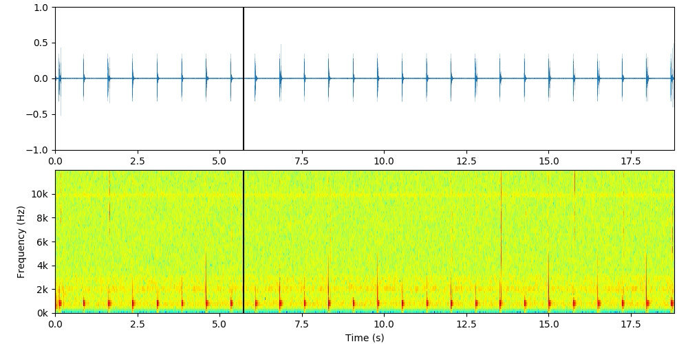

# Experimental study on the acoustic emission of an air bubble in water

> The repository was used during the development of my Master's in the field of Acoustics. Focused on the experimental study on the acoustic emission of an air bubble in water. Digital Signal Processing techniques are applied in this work and are complemented with some Digital Image Processing techniques.

## Table of Contents

- [Description of the content](#description)
- [How to use this repository](#how-to-use)
- [References](#references)
- [Author Info](#author-info)

---

## Description of the content

### Scripts folder

In this folder, there are some scripts that can be used to rename files, create an specific .cmd file, among others.

**bubble_simulation.py**: This script is used for the simulation of the acoustic signal emission of a bubble in water using the mathematical model proposed by Strasberg [[1]](#references).

### SignalProcessing folder

**signal_analysis.py** is used to carry out various analyzes on the acoustic signal emitted by a controlled air bubble generated in the water. Sound Frequency analysis was one of them.

**signal_separator.py** is used to separate each bubble that appears in the analyzed acoustic signal, in independent acoustic signals.

**signal_cutter.py** is used to cut the precise time interval obtained by the marks performed during recording of the entire acoustic signal.

**general_analysis.py** is used to carry out some analyzes over the three acoustic signals obtained, for example, show the mean frequency of each acoustic signal, all in the same graph.

**json_manager.py** is used to create and update the JSON file using the library `jilib`.

&nbsp;

  
> In this work, some techniques were applied to achieve a reproduction of the acoustic signal on its respective spectrogram. [Here](https://www.youtube.com/channel/UCBacHKerJjp4PwmgcCPCyGg) is the video.

&nbsp;

### ImageProcessing folder

For the images segmentation [[2]](#references)[[3]](#references), **image_segmentation.py** is used to detect and separate the bubble that appears in the image, using some methods (`drlse` and `gfd`), in ordet to determine some characteristics, such as the volume of the bubble.

Some scripts can be found in this folder. **frame_extractor_by_folder.py** is used to separate a set of videos into their respective frames, and **frame_extractor.py** is used to separate a video.

There's also the **video_creator.py** script that was developed to create slow motion videos from a set of images.

(*) **dsip** is a module developed that incorporates its own libraries such as `sigproc` `improc` and `jilib`, as well as others available publicly.

[Back To The Top](#table-of-contents)

---

## How To Use

All files in this repository are developed using Python v3, with the following libraries:

    - JSON (std)
    - Matplotlib (3.3.4)
    - Numpy (1.20.1)
    - OpenCV (4.5.1)
    - OS (std)
    - Pandas (1.2.2)
    - Scikit-Image (0.18.1)
    - Scikit-Learn (0.24.1)
    - Scipy (1.6.1)
    - TQDM (4.58.0)
    -------------------
    - dsip (0.1a)*

### Installation

(*) This is a module developed that incorporates the libraries and functions used for all the scripts. It must be copied to some of the addresses included in the Python path to use it. It is strongly recommended to create a virtual environment and copy the module inside it in path `/lib/python3.x/site-packages/` to add it to Python's path.

All the libraries used can be installed using PyPI or it can be installed used the `requirements.txt` file.

[Back To The Top](#table-of-contents)

---

## References

[1] Strasberg, M. *Gas bubbles as sources of sound in liquids*. The Journal of the Acoustical Society of America, vol. 28, no. 1, p. 20–26, 1956.

[2] LI, C. & XU, C. & GUI, C. & FOX, M. D. *Distance Regularized Level Set Evolution and Its Application to Image Segmentation*. IEEE Transactions On Image Processing, vol. 19, no. 12, p. 3243-3254, 2010.

[3] Zhang, D. & Lu, G. *Shape-based image retrieval using generic Fourier descriptor*. Signal Processing: Image Communication, vol. 17, p. 825–848, 2002

[Back To The Top](#table-of-contents)

---

## Author Info

- email: [dejongh.morell@gmail.com](mailto:dejongh.morell@gmail.com)

- LinkedIn: [adejonghm](https://www.linkedin.com/in/adejonghm/)

- CodersRank: [adejonghm](https://profile.codersrank.io/user/adejonghm/)

<!-- - Telegram: [adejonghm](https://aaa/adejonghm/) -->

[Back To The Top](#table-of-contents)
